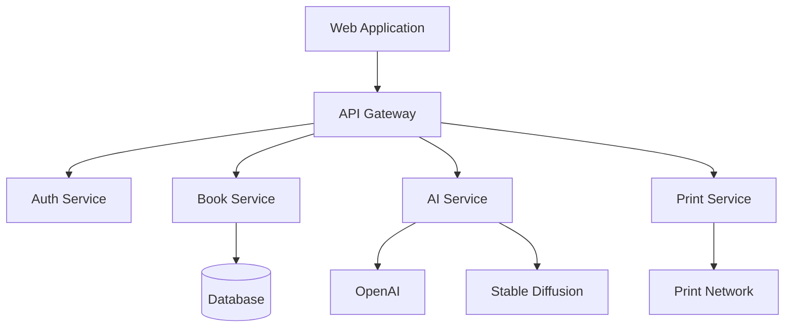

# Memorable - AI-Powered Children's Book Creation Platform

<div align="center">
  

  [](https://github.com/memorable/memorable/actions)
  [](https://codecov.io/gh/memorable/memorable)
  [](https://libraries.io/github/memorable/memorable)
  [](./LICENSE)
</div>

## Overview

Memorable is a revolutionary web-based platform that enables the creation of personalized children's books through AI-powered story generation and illustration. Our platform combines cutting-edge AI technology with eco-conscious local printing networks to deliver professional-quality books featuring your loved ones as main characters.

### Key Features

- 🤖 AI-powered story generation using GPT-4
- 🎨 Custom illustration creation via Stable Diffusion XL
- 🖨️ Eco-friendly local print network integration
- 📱 Responsive web-based interface
- 🔒 Enterprise-grade security
- ♻️ Sustainable production practices

### System Architecture



## Prerequisites

### Development Environment

- Node.js `18.x`
- Python `3.11+`
- Docker `24.0+`

### Infrastructure Tools

- AWS CLI (latest)
- Terraform `1.5+`

### IDE Setup

We recommend Visual Studio Code with the following extensions:
- ESLint
- Prettier
- Docker
- GitLens
- Python

## Installation

### Local Development Setup

1. Clone the repository:
```bash
git clone https://github.com/memorable/memorable.git
cd memorable
```

2. Install dependencies:
```bash
# Frontend dependencies
npm install

# Backend dependencies
pip install -r requirements.txt
```

3. Configure environment:
```bash
cp .env.example .env
# Edit .env with your configuration
```

4. Setup database:
```bash
npm run db:setup
```

5. Configure AI services:
```bash
# Set up OpenAI and Stable Diffusion credentials in .env
```

### Docker Setup

1. Build containers:
```bash
docker-compose build
```

2. Start services:
```bash
docker-compose up -d
```

### Infrastructure Setup

1. Configure AWS credentials:
```bash
aws configure
```

2. Initialize Terraform:
```bash
cd infrastructure
terraform init
```

3. Deploy infrastructure:
```bash
terraform plan
terraform apply
```

## Development

### Local Development

Start the development server:
```bash
npm run dev
```

### Testing

Run the test suite:
```bash
# Frontend tests
npm test

# Backend tests
pytest

# E2E tests
npm run test:e2e
```

### Building

Create a production build:
```bash
npm run build
```

## Deployment

### Environments

- Development: `dev.memorable.com`
- Staging: `staging.memorable.com`
- Production: `memorable.com`

### Deployment Procedures

1. Automated deployments via GitHub Actions
2. Environment-specific configurations
3. Blue-green deployment strategy
4. Automated rollback capabilities

### Monitoring

- Application performance via DataDog
- Error tracking via Sentry
- Infrastructure monitoring via CloudWatch
- Custom metrics dashboard

## Documentation

- [API Documentation](./docs/api/README.md)
- [Architecture Guide](./docs/architecture/README.md)
- [User Guide](./docs/user/README.md)

## Contributing

Please read our [Contributing Guidelines](./CONTRIBUTING.md) before submitting pull requests.

## Changelog

See [CHANGELOG.md](./CHANGELOG.md) for version history and changes.

## License

This project is licensed under the terms of the [LICENSE](./LICENSE) file.

## Support

- 📧 Email: support@memorable.com
- 💬 Discord: [Join our community](https://discord.gg/memorable)
- 📚 Documentation: [docs.memorable.com](https://docs.memorable.com)

## Acknowledgments

- OpenAI for GPT-4 integration
- Stability AI for Stable Diffusion
- Our network of eco-conscious print partners
- The open-source community

---

<div align="center">
  Made with ❤️ by the Memorable Team
</div>