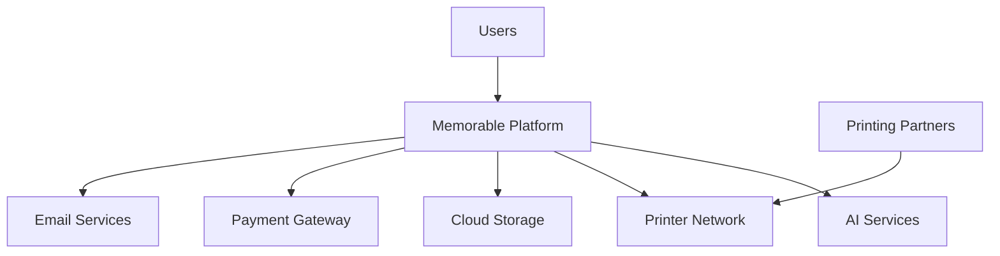
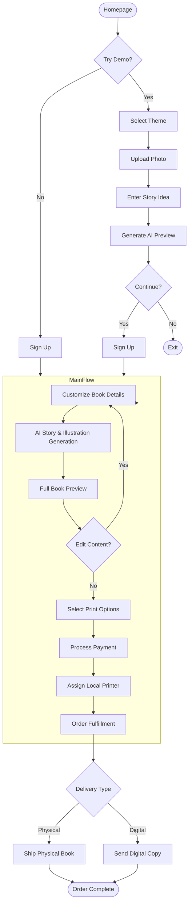
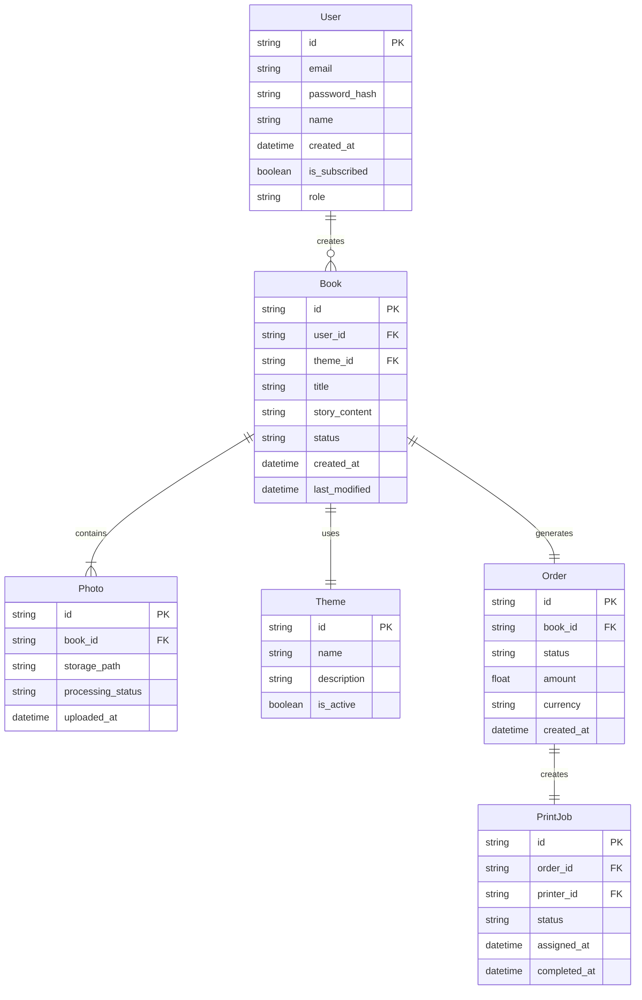
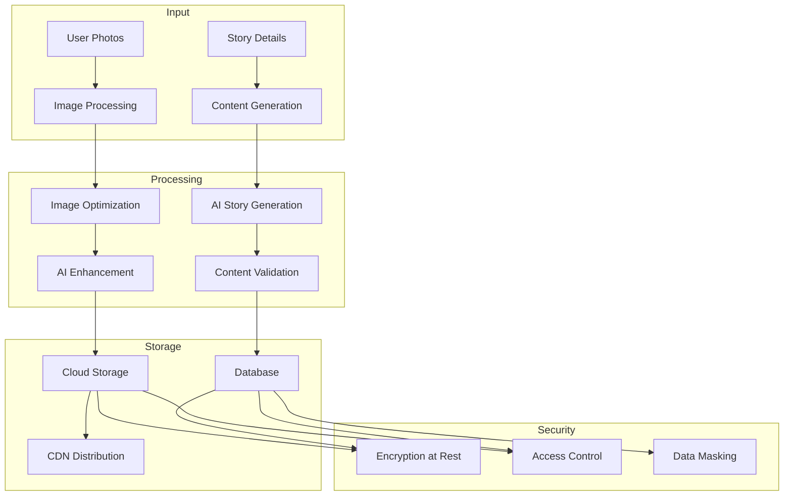

# Product Requirements Document (PRD)

# 1. INTRODUCTION

## 1.1 Purpose

This Software Requirements Specification (SRS) document provides a comprehensive description of the Memorable platform's implementation requirements. It is intended for:

- Development team members implementing the system
- Project managers overseeing the development process
- QA engineers designing test cases
- Stakeholders evaluating technical specifications
- Third-party integrators working with the printing API

## 1.2 Scope

Memorable is a web-based platform that enables users to create personalized children's books using AI-generated content and illustrations. The system encompasses:

- Interactive book creation interface with theme selection and photo upload capabilities
- AI integration for story generation and image creation
- Demo mode with limited preview functionality
- User account management and progress tracking
- Integration with local printing services
- Payment processing and order management
- Digital book delivery system

Key benefits:
- Automated personalized book creation
- Eco-friendly local printing network
- Seamless user experience from demo to purchase
- Scalable architecture supporting global deployment

Core functionalities:
- Theme-based story customization
- AI-powered content generation
- Photo processing and integration
- Preview system with watermarking
- Progress-saving mechanism
- Local printer API integration
- Multi-format book delivery (physical and digital)

# 2. PRODUCT DESCRIPTION

## 2.1 Product Perspective

Memorable operates as a standalone web-based platform that integrates with several external systems:

- OpenAI/Stable Diffusion APIs for content generation
- Local printer network APIs for fulfillment
- Cloud storage services (AWS/GCP) for asset management
- Payment processing systems (Stripe/PayPal)
- Email delivery services for notifications

System Context Diagram:

## 2.2 Product Functions

- Book Creation and Customization
  - Theme selection and story ideation
  - Photo upload and processing
  - AI-powered story generation
  - Custom illustration creation
  - Content preview and editing

- User Management
  - Demo mode access
  - Account creation and authentication
  - Progress saving and restoration
  - Order history tracking

- Production and Delivery
  - Print option selection
  - Local printer assignment
  - Order fulfillment tracking
  - Digital copy generation
  - Shipping coordination

- Payment Processing
  - Multiple payment method support
  - Subscription management
  - Secure transaction handling
  - Refund processing

## 2.3 User Characteristics

| User Type | Characteristics | Technical Expertise | Usage Patterns |
|-----------|----------------|---------------------|----------------|
| Primary Users | Parents/Grandparents (25-65) | Basic to intermediate computer skills | Occasional use, focused on single books |
| Educators | Teachers/Librarians | Intermediate computer literacy | Regular use, multiple books |
| Gift Givers | Friends/Family (20+) | Basic computer skills | Seasonal/occasional use |
| Business Users | Corporate gift coordinators | Intermediate to advanced | Bulk orders, regular use |

## 2.4 Constraints

Technical Constraints:
- Browser compatibility requirements (Chrome, Firefox, Safari, Edge)
- Mobile device responsiveness limitations
- AI processing time restrictions
- Image resolution and file size limits
- Printer capability variations

Regulatory Constraints:
- GDPR and CCPA compliance requirements
- Children's Online Privacy Protection Act (COPPA) compliance
- Payment industry (PCI) standards
- Copyright and intellectual property regulations

Business Constraints:
- Local printer network availability
- API usage costs and limitations
- Storage capacity restrictions
- Shipping radius limitations

## 2.5 Assumptions and Dependencies

Assumptions:
- Users have access to digital photos
- Stable internet connectivity
- Basic device camera functionality
- English language proficiency
- Access to standard payment methods

Dependencies:
- AI service availability and performance
- Printer network reliability
- Cloud service uptime
- Payment gateway functionality
- Shipping carrier services
- Third-party API stability
- SSL certificate maintenance
- Domain name registration

# 3. PROCESS FLOWCHART

# 4. FUNCTIONAL REQUIREMENTS

## 4.1 Book Creation Engine

### ID: F-BCE-001
### Description
Core system for generating personalized children's books using AI technology and user inputs
### Priority: Critical
### Requirements

| ID | Requirement | Priority | Notes |
|----|-------------|----------|--------|
| BCE-01 | Theme selection from predefined categories | High | Magical, adventure, educational themes |
| BCE-02 | Photo upload and processing (max 10MB per image) | High | JPEG, PNG, HEIF formats |
| BCE-03 | AI story generation using OpenAI API | Critical | Response time < 30s |
| BCE-04 | AI illustration generation using Stable Diffusion | Critical | Min 300 DPI resolution |
| BCE-05 | Story customization options (character traits, settings) | Medium | |
| BCE-06 | Progress auto-save every 30 seconds | High | |
| BCE-07 | Book preview generation with watermarks | High | Demo mode |

## 4.2 User Management System

### ID: F-UMS-001
### Description
Account management and authentication system for users
### Priority: High
### Requirements

| ID | Requirement | Priority | Notes |
|----|-------------|----------|--------|
| UMS-01 | User registration and authentication | High | Email verification required |
| UMS-02 | Demo to full account conversion | High | Preserve all progress |
| UMS-03 | Password reset functionality | Medium | 24hr reset link validity |
| UMS-04 | Order history tracking | Medium | |
| UMS-05 | Multiple book project management | Low | |
| UMS-06 | Subscription management | Low | Future feature |

## 4.3 Print Production System

### ID: F-PPS-001
### Description
System for managing print orders and printer network integration
### Priority: High
### Requirements

| ID | Requirement | Priority | Notes |
|----|-------------|----------|--------|
| PPS-01 | Local printer API integration | Critical | REST API implementation |
| PPS-02 | Print quality options selection | High | Softcover, hardcover, premium |
| PPS-03 | Printer assignment algorithm | High | Based on location and capacity |
| PPS-04 | Print job tracking | Medium | Real-time status updates |
| PPS-05 | Digital copy generation | Medium | PDF format |
| PPS-06 | Quality control checkpoints | High | Pre-flight checks |

## 4.4 Payment Processing

### ID: F-PAY-001
### Description
Secure payment processing and order management system
### Priority: Critical
### Requirements

| ID | Requirement | Priority | Notes |
|----|-------------|----------|--------|
| PAY-01 | Integration with Stripe/PayPal | Critical | PCI compliant |
| PAY-02 | Multiple currency support | High | Initial: USD, EUR, GBP |
| PAY-03 | Automated refund processing | Medium | Within 48hrs |
| PAY-04 | Invoice generation | Medium | PDF format |
| PAY-05 | Subscription billing | Low | Future feature |

## 4.5 Delivery Management

### ID: F-DEL-001
### Description
System for coordinating physical and digital book delivery
### Priority: High
### Requirements

| ID | Requirement | Priority | Notes |
|----|-------------|----------|--------|
| DEL-01 | Shipping carrier integration | High | Multiple carrier support |
| DEL-02 | Digital delivery system | High | Secure download links |
| DEL-03 | Tracking number generation | Medium | Real-time updates |
| DEL-04 | Delivery status notifications | Medium | Email + in-app |
| DEL-05 | Address validation | High | International support |

# 5. NON-FUNCTIONAL REQUIREMENTS

## 5.1 Performance Requirements

| Category | Requirement | Target Metric |
|----------|-------------|---------------|
| Response Time | Page load time | < 3 seconds |
| Response Time | AI story generation | < 30 seconds |
| Response Time | AI illustration generation | < 45 seconds |
| Throughput | Concurrent users | 10,000+ |
| Throughput | Book generations per hour | 1,000+ |
| Resource Usage | Image storage per book | < 50MB |
| Resource Usage | Server memory utilization | < 85% |
| Resource Usage | CDN cache hit ratio | > 90% |

## 5.2 Safety Requirements

| Category | Requirement | Implementation |
|----------|-------------|----------------|
| Data Backup | Automated backups | Every 6 hours |
| Data Recovery | Recovery Point Objective (RPO) | < 1 hour |
| Data Recovery | Recovery Time Objective (RTO) | < 4 hours |
| Fault Tolerance | System redundancy | N+1 configuration |
| Error Handling | Graceful degradation | Fallback to basic features |
| Session Management | Auto-save frequency | Every 30 seconds |
| Disaster Recovery | Geographic redundancy | Multi-region deployment |

## 5.3 Security Requirements

| Category | Requirement | Specification |
|----------|-------------|---------------|
| Authentication | Multi-factor authentication | Optional for users |
| Authentication | Password complexity | Min 8 chars, mixed case, numbers |
| Authorization | Role-based access control | User, Admin, Partner roles |
| Encryption | Data in transit | TLS 1.3 |
| Encryption | Data at rest | AES-256 |
| Privacy | Data retention | 90 days for inactive accounts |
| Privacy | User consent | Explicit opt-in for data usage |
| API Security | Rate limiting | 100 requests/min per user |
| Monitoring | Security logging | Real-time alert system |

## 5.4 Quality Requirements

### 5.4.1 Availability
- System uptime: 99.9%
- Planned maintenance: < 4 hours/month
- Service degradation: < 0.1%

### 5.4.2 Maintainability
- Code coverage: > 80%
- Documentation freshness: < 30 days
- Technical debt ratio: < 5%

### 5.4.3 Usability
- First-time user success rate: > 90%
- Task completion rate: > 95%
- User error rate: < 1%
- Mobile responsiveness: 100% compliance

### 5.4.4 Scalability
- Horizontal scaling: Auto-scaling groups
- Vertical scaling: On-demand resource allocation
- Database scaling: Automatic sharding
- Load balancing: Round-robin distribution

### 5.4.5 Reliability
- Mean Time Between Failures (MTBF): > 720 hours
- Mean Time To Recovery (MTTR): < 15 minutes
- Error rate: < 0.1% of transactions
- Data integrity: 100% verification

## 5.5 Compliance Requirements

| Category | Requirement | Standard |
|----------|-------------|----------|
| Data Protection | GDPR compliance | Full compliance |
| Data Protection | CCPA compliance | Full compliance |
| Child Safety | COPPA compliance | Full compliance |
| Payment | PCI DSS compliance | Level 1 |
| Accessibility | WCAG compliance | Level AA |
| Security | SOC 2 Type II | Annual certification |
| Privacy | Privacy Shield | EU-US framework |
| Infrastructure | ISO 27001 | Certification required |

# 6. DATA REQUIREMENTS

## 6.1 Data Models

## 6.2 Data Storage

### 6.2.1 Primary Storage

| Data Type | Storage Solution | Retention Period | Backup Frequency |
|-----------|-----------------|------------------|------------------|
| User Data | PostgreSQL | Account lifetime | Every 6 hours |
| Book Content | PostgreSQL | Account lifetime | Every 6 hours |
| Images | S3/Cloud Storage | Account lifetime | Daily |
| Generated AI Content | S3/Cloud Storage | 90 days | Daily |
| Order History | PostgreSQL | 7 years | Every 6 hours |
| Session Data | Redis | 24 hours | Real-time replication |

### 6.2.2 Redundancy Configuration

| Storage Type | Redundancy Method | Recovery Time |
|--------------|-------------------|---------------|
| Database | Multi-AZ deployment | < 15 minutes |
| File Storage | Cross-region replication | < 30 minutes |
| Cache | Redis cluster with replicas | < 5 minutes |
| Backups | Geographic replication | < 4 hours |

## 6.3 Data Processing

### 6.3.1 Data Security Measures

| Security Layer | Implementation | Standard |
|----------------|----------------|-----------|
| Encryption at Rest | AES-256 | FIPS 140-2 |
| Encryption in Transit | TLS 1.3 | PCI DSS |
| Access Control | RBAC + IAM | ISO 27001 |
| Data Masking | Dynamic masking | GDPR |
| Key Management | AWS KMS/Cloud KMS | NIST |

### 6.3.2 Data Processing Requirements

| Process | SLA | Capacity | Scaling Method |
|---------|-----|----------|----------------|
| Image Processing | < 10s | 100/minute | Horizontal |
| Story Generation | < 30s | 50/minute | Vertical |
| Content Validation | < 5s | 200/minute | Horizontal |
| Data Synchronization | < 1s | 1000/minute | Horizontal |

# 7. EXTERNAL INTERFACES

## 7.1 User Interfaces

### 7.1.1 Web Application Interface

| Screen | Requirements | Components |
|--------|--------------|------------|
| Homepage | - Responsive design (320px-2560px) - Load time < 2s - Prominent "Try Demo" CTA | - Hero section - Theme previews - Sample book gallery |
| Book Creator | - Drag-and-drop photo upload - Real-time preview - Progress indicator | - Theme selector - Photo editor - Story input form |
| Preview Mode | - Watermarked illustrations - Page flip animation - Sign-up conversion prompt | - Book viewer - Page navigation - Upgrade CTA |
| Account Dashboard | - Project management - Order tracking - Settings panel | - Book library - Order history - Profile settings |

### 7.1.2 Mobile Responsiveness

| Breakpoint | Layout Adjustments |
|------------|-------------------|
| Desktop (>1024px) | Full feature set, multi-column layout |
| Tablet (768px-1024px) | Simplified navigation, adapted grid |
| Mobile (<768px) | Single column, touch-optimized controls |

## 7.2 Software Interfaces

### 7.2.1 AI Services Integration

| Service | Interface Type | Purpose |
|---------|---------------|----------|
| OpenAI API | REST API | Story generation |
| Stable Diffusion | REST API | Illustration creation |
| Custom ML Models | gRPC | Image processing |

### 7.2.2 External Services

| Service | Protocol | Data Format |
|---------|----------|-------------|
| AWS S3 | HTTPS | Binary/JSON |
| Stripe/PayPal | REST API | JSON |
| Email Service | SMTP | MIME |
| Printer Network | REST API | JSON/XML |

## 7.3 Communication Interfaces

### 7.3.1 API Specifications

| Endpoint Category | Protocol | Authentication |
|------------------|-----------|----------------|
| User API | HTTPS/REST | JWT |
| Content API | HTTPS/REST | API Key |
| Printer API | HTTPS/REST | OAuth 2.0 |
| Payment API | HTTPS/REST | API Key + Webhook |

### 7.3.2 Data Exchange Formats

| Interface | Format | Validation |
|-----------|--------|------------|
| API Requests | JSON | JSON Schema |
| File Upload | Multipart/form-data | MIME type |
| Print Jobs | PDF/X-1a:2001 | Preflight check |
| Image Assets | JPEG/PNG/TIFF | ICC profile |

### 7.3.3 Network Requirements

| Connection Type | Specification | Usage |
|----------------|---------------|--------|
| Client-Server | HTTPS/WSS | User interactions |
| Server-AI | HTTPS | Content generation |
| Server-Printer | VPN/HTTPS | Print job submission |
| CDN | HTTPS | Asset delivery |

## 7.4 Hardware Interfaces

### 7.4.1 Printer Requirements

| Component | Specification | Protocol |
|-----------|---------------|----------|
| Print Resolution | 300 DPI minimum | CMYK |
| Paper Handling | A4/US Letter | Physical |
| Color Management | ICC Profile support | Digital |
| Network Interface | Gigabit Ethernet | TCP/IP |

### 7.4.2 Storage Requirements

| Component | Specification | Interface |
|-----------|---------------|-----------|
| Primary Storage | SSD/NVMe | PCIe 4.0 |
| Backup Storage | HDD RAID | SAS/SATA |
| Network Storage | NAS/SAN | iSCSI |

# 8. APPENDICES

## 8.1 GLOSSARY

| Term | Definition |
|------|------------|
| Demo Mode | Limited preview functionality allowing users to test book creation without an account |
| Local Printer Network | Distributed network of eco-conscious printing partners for fulfillment |
| Progress-saving | Automatic preservation of user's book creation progress |
| Watermarking | Digital overlay on preview images to protect intellectual property |
| ICC Profile | Color management system ensuring consistent print quality |
| Pre-flight Check | Quality control process for print-ready files |
| Theme | Predefined story category with specific visual and narrative elements |
| Premium Edition | Enhanced version of books with special materials and packaging |

## 8.2 ACRONYMS

| Acronym | Definition |
|---------|------------|
| AI | Artificial Intelligence |
| API | Application Programming Interface |
| AWS | Amazon Web Services |
| CCPA | California Consumer Privacy Act |
| CDN | Content Delivery Network |
| CMYK | Cyan, Magenta, Yellow, Key (Black) |
| COPPA | Children's Online Privacy Protection Act |
| DPI | Dots Per Inch |
| GDPR | General Data Protection Regulation |
| GCP | Google Cloud Platform |
| HEIF | High Efficiency Image Format |
| IAM | Identity and Access Management |
| JWT | JSON Web Token |
| KMS | Key Management Service |
| ML | Machine Learning |
| NAS | Network Attached Storage |
| PCI DSS | Payment Card Industry Data Security Standard |
| RBAC | Role-Based Access Control |
| REST | Representational State Transfer |
| SAN | Storage Area Network |
| SLA | Service Level Agreement |
| SOC | System and Organization Controls |
| SSL | Secure Sockets Layer |
| TLS | Transport Layer Security |
| UI | User Interface |
| VPN | Virtual Private Network |
| WCAG | Web Content Accessibility Guidelines |
| WSS | WebSocket Secure |

## 8.3 ADDITIONAL REFERENCES

| Category | Reference | Purpose |
|----------|-----------|----------|
| AI Integration | OpenAI API Documentation | Story generation implementation |
| AI Integration | Stable Diffusion Documentation | Illustration generation |
| Print Standards | PDF/X-1a:2001 Specification | Print file preparation |
| Color Management | ICC Profile Guidelines | Color accuracy standards |
| Security | NIST Cybersecurity Framework | Security implementation |
| Accessibility | WCAG 2.1 Guidelines | Accessibility compliance |
| Development | React.js Documentation | Frontend implementation |
| Development | Node.js Documentation | Backend implementation |
| Cloud Services | AWS Documentation | Infrastructure setup |
| Payment | Stripe API Documentation | Payment processing |
| Shipping | Printify API Documentation | Print fulfillment |