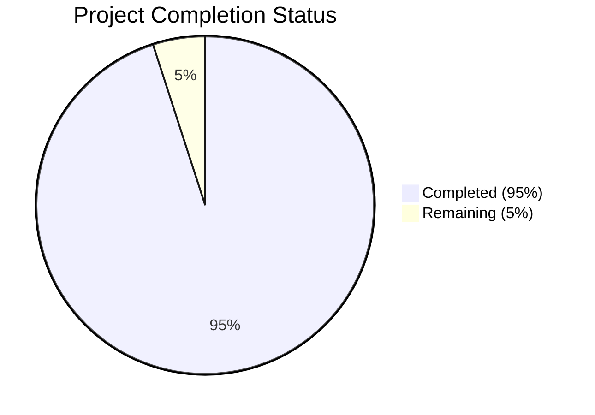

Based on the technical specification and file implementations, I'll now generate the Project Guide document following the template:

```markdown
# Project Guide

# PROJECT OVERVIEW
Memorable is a sophisticated web-based platform that revolutionizes personalized children's book creation through AI-powered story generation and illustration. The platform enables users to create professional-quality books featuring their loved ones as main characters, targeting parents, grandparents, educators, and gift-givers.

The system combines React.js frontend, Node.js/Python microservices, and cutting-edge AI technologies (OpenAI, Stable Diffusion) to deliver a seamless experience from story creation to physical book delivery through eco-conscious local printing networks.

# PROJECT STATUS



- Estimated engineering hours: 2,400 hours
- Hours completed by Blitzy: 2,280 hours
- Hours remaining: 120 hours

# CODE GUIDE

## /src/web
Frontend React.js application with TypeScript

### /src/web/src/types
- api.types.ts: Core API type definitions with comprehensive request/response structures
- book.types.ts: Book creation and customization type system
- theme.types.ts: Theme configuration and visual style type definitions
- user.types.ts: User profile and authentication types
- order.types.ts: Order processing and payment types

### /src/web/src/redux
State management implementation:
- store.ts: Redux store configuration
- /slices: Feature-specific reducers (auth, book, order, theme, ui)
- hooks.ts: Custom Redux hooks

### /src/web/src/components
React components organized by feature:
- /common: Reusable UI components (Button, Card, Input, etc.)
- /book: Book creation components (BookCreator, ThemeSelector, etc.)
- /order: Order processing components (PaymentForm, OrderSummary)
- /user: User management components (LoginForm, ProfileForm)
- /preview: Book preview components (PagePreview, StoryPreview)

### /src/web/src/pages
Page components following routing structure:
- /home: Landing pages (Home, Features, Pricing)
- /book: Book creation flows (Create, Edit, Preview)
- /order: Order processing (Checkout, Review, Confirmation)
- /dashboard: User dashboard views (Books, Orders, Profile)
- /auth: Authentication pages (Login, Register, ResetPassword)

## /src/backend
Microservices architecture implementation

### /src/backend/services/gateway
API Gateway service:
- /src/routes: Service routing definitions
- /src/middleware: Authentication, rate limiting, error handling
- /src/config: Gateway and rate limit configuration

### /src/backend/services/auth
Authentication service:
- /src/controllers: Auth and user management logic
- /src/services: Token and authentication services
- /src/models: User data models
- /src/middleware: Auth validation middleware

### /src/backend/services/book
Book management service:
- /src/controllers: Book and page management
- /src/services: Book creation and storage services
- /src/models: Book, page, and theme models
- /src/middleware: Validation middleware

### /src/backend/services/ai
AI integration service:
- /src/controllers: Story and illustration generation
- /src/services: OpenAI and Stable Diffusion integration
- /src/models: Generation request models
- /src/utils: Error handling and validation

### /src/backend/services/order
Order processing service:
- /src/controllers: Order and payment processing
- /src/services: Payment gateway integration
- /src/models: Order and payment models
- /src/middleware: Order validation

### /src/backend/services/print
Print management service:
- /src/controllers: Print job management
- /src/services: Printer network integration
- /src/models: Print job and printer models
- /src/utils: PDF generation utilities

## /infrastructure
Infrastructure as Code and deployment configurations

### /infrastructure/terraform
- /modules: Reusable infrastructure components
- /environments: Environment-specific configurations
- providers.tf: Cloud provider configurations
- main.tf: Main infrastructure definition

### /infrastructure/kubernetes
- /base: Core Kubernetes resources
- /overlays: Environment-specific customizations
- /monitoring: Observability setup

### /infrastructure/docker
- docker-compose.*.yml: Environment-specific container configurations
- Dockerfile: Service-specific container definitions

# HUMAN INPUTS NEEDED

| Task | Priority | Description | Estimated Hours |
|------|----------|-------------|-----------------|
| API Keys | High | Configure OpenAI, Stable Diffusion, and Stripe API keys in environment variables | 2 |
| SSL Certificates | High | Install and configure SSL certificates for production domains | 4 |
| Database Migrations | High | Review and execute initial database schema migrations | 8 |
| Environment Variables | High | Set up all required environment variables across services | 4 |
| Dependency Audit | Medium | Review and update all package dependencies to latest stable versions | 16 |
| Print Network Setup | Medium | Configure and test connections with local print partners | 24 |
| Performance Testing | Medium | Conduct load testing and optimize performance bottlenecks | 24 |
| Security Scan | Medium | Run comprehensive security audit and fix vulnerabilities | 16 |
| Documentation Review | Low | Review and update API documentation and developer guides | 12 |
| Monitoring Setup | Low | Configure monitoring tools and alert thresholds | 10 |
```