# Technical Specifications

# 1. INTRODUCTION

## 1.1 EXECUTIVE SUMMARY

Memorable is a web-based platform that revolutionizes personalized children's book creation through AI-powered story generation and illustration. The system addresses the growing demand for customized children's content by enabling users to create professional-quality books featuring their loved ones as main characters. The platform serves parents, grandparents, educators, and gift-givers who seek meaningful, personalized storytelling experiences.

The solution combines cutting-edge AI technology with eco-conscious local printing networks to deliver a seamless experience from story creation to physical book delivery. Through its innovative demo-to-conversion model, the platform maximizes user engagement while ensuring sustainable business growth.

## 1.2 SYSTEM OVERVIEW

### Project Context

| Aspect | Details |
|--------|----------|
| Market Position | First-to-market AI-powered personalized children's book platform with local printing network |
| Target Market | Primary: Parents/Grandparents (25-65), Secondary: Educators and Gift-Givers |
| Competitive Edge | Seamless demo-to-purchase flow, AI-powered content generation, eco-friendly printing |
| Enterprise Integration | Standalone platform with API-driven printer network integration |

### High-Level Description

| Component | Implementation |
|-----------|----------------|
| Frontend Platform | React.js-based responsive web application |
| AI Engine | OpenAI for story generation, Stable Diffusion for illustrations |
| Content Management | Cloud-based asset management with CDN distribution |
| Print Network | API-integrated local printer management system |
| Payment Processing | PCI-compliant payment gateway integration |

### Success Criteria

| Metric | Target |
|--------|---------|
| User Conversion | >25% demo-to-paid conversion rate |
| System Performance | <3s page load time, <30s AI generation time |
| Print Quality | >95% customer satisfaction rate |
| Platform Availability | 99.9% uptime |
| Market Penetration | 10,000 books/month within first year |

## 1.3 SCOPE

### In-Scope Elements

#### Core Features and Functionalities

| Category | Components |
|----------|------------|
| Book Creation | Theme selection, photo upload, story customization |
| AI Generation | Story writing, illustration creation, content optimization |
| User Management | Account creation, progress saving, order history |
| Print Production | Local printer assignment, quality control, shipping |
| Payment Processing | Multiple payment methods, subscription management |

#### Implementation Boundaries

| Boundary Type | Coverage |
|--------------|----------|
| Geographic | North America, Western Europe (Phase 1) |
| Language | English (Phase 1) |
| User Types | Individual users, educators, business accounts |
| Book Formats | Softcover, hardcover, premium editions |

### Out-of-Scope Elements

| Category | Excluded Items |
|----------|----------------|
| Features | - Multi-language support (future phase)<br>- Mobile native apps<br>- Custom theme creation<br>- Direct printer management interface |
| Integrations | - Social media publishing<br>- Third-party marketplace integration<br>- Content management systems |
| Markets | - Asia-Pacific region (future phase)<br>- B2B wholesale distribution<br>- Custom enterprise solutions |
| Support | - 24/7 customer service<br>- In-person training<br>- White-label solutions |

# 2. SYSTEM ARCHITECTURE

## 2.1 High-Level Architecture

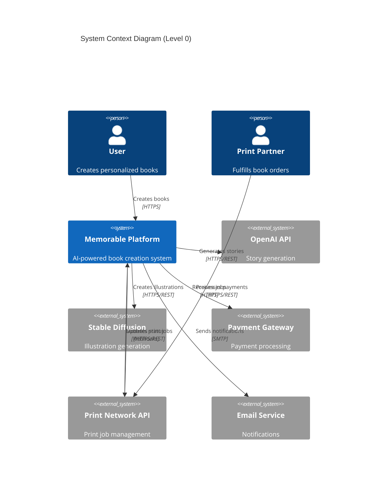
```mermaid
C4Context
    title System Context Diagram (Level 0)

    Person(user, "User", "Creates personalized books")
    Person(printer, "Print Partner", "Fulfills book orders")
    
    System(memorable, "Memorable Platform", "AI-powered book creation system")
    
    System_Ext(openai, "OpenAI API", "Story generation")
    System_Ext(stableDiffusion, "Stable Diffusion", "Illustration generation")
    System_Ext(stripe, "Payment Gateway", "Payment processing")
    System_Ext(printAPI, "Print Network API", "Print job management")
    System_Ext(email, "Email Service", "Notifications")

    Rel(user, memorable, "Creates books", "HTTPS")
    Rel(memorable, openai, "Generates stories", "HTTPS/REST")
    Rel(memorable, stableDiffusion, "Creates illustrations", "HTTPS/REST")
    Rel(memorable, stripe, "Processes payments", "HTTPS/REST")
    Rel(memorable, printAPI, "Submits print jobs", "HTTPS/REST")
    Rel(memorable, email, "Sends notifications", "SMTP")
    Rel(printer, printAPI, "Receives jobs", "HTTPS")
    Rel(printAPI, memorable, "Updates status", "Webhooks")
```

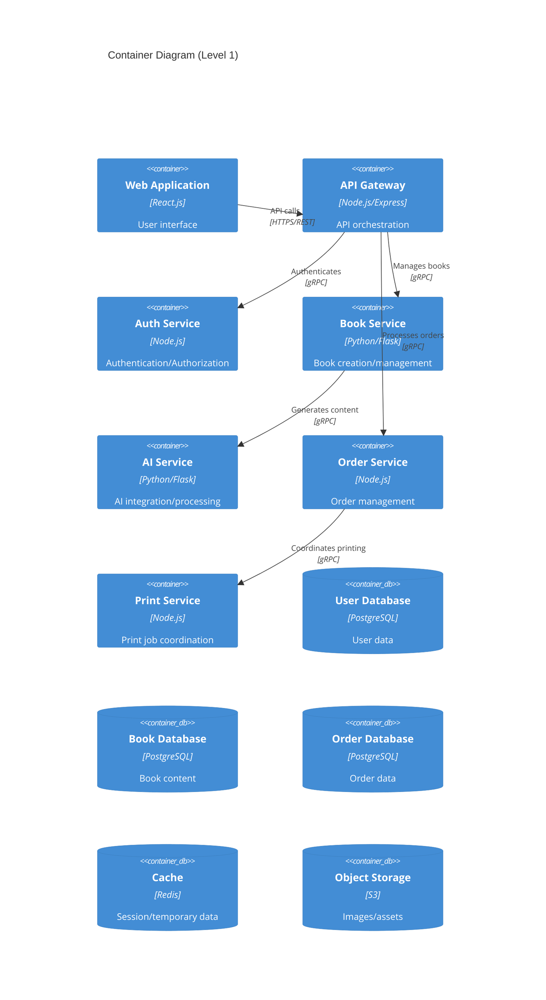
```mermaid
C4Container
    title Container Diagram (Level 1)

    Container(web, "Web Application", "React.js", "User interface")
    Container(api, "API Gateway", "Node.js/Express", "API orchestration")
    Container(auth, "Auth Service", "Node.js", "Authentication/Authorization")
    Container(book, "Book Service", "Python/Flask", "Book creation/management")
    Container(ai, "AI Service", "Python/Flask", "AI integration/processing")
    Container(order, "Order Service", "Node.js", "Order management")
    Container(print, "Print Service", "Node.js", "Print job coordination")
    
    ContainerDb(userDb, "User Database", "PostgreSQL", "User data")
    ContainerDb(bookDb, "Book Database", "PostgreSQL", "Book content")
    ContainerDb(orderDb, "Order Database", "PostgreSQL", "Order data")
    ContainerDb(cache, "Cache", "Redis", "Session/temporary data")
    ContainerDb(storage, "Object Storage", "S3", "Images/assets")

    Rel(web, api, "API calls", "HTTPS/REST")
    Rel(api, auth, "Authenticates", "gRPC")
    Rel(api, book, "Manages books", "gRPC")
    Rel(api, order, "Processes orders", "gRPC")
    Rel(book, ai, "Generates content", "gRPC")
    Rel(order, print, "Coordinates printing", "gRPC")
```

## 2.2 Component Details

### 2.2.1 Core Components

| Component | Purpose | Technology Stack | Scaling Strategy |
|-----------|---------|-----------------|------------------|
| Web Application | User interface and interaction | React.js, Redux, Material-UI | Horizontal with CDN |
| API Gateway | Request routing and aggregation | Node.js, Express, Kong | Horizontal with load balancing |
| Auth Service | Identity and access management | Node.js, Passport.js, JWT | Horizontal with session replication |
| Book Service | Book creation and management | Python, Flask, SQLAlchemy | Vertical with read replicas |
| AI Service | Content generation orchestration | Python, Flask, Celery | Horizontal with queue-based scaling |
| Order Service | Order processing and tracking | Node.js, Express, Sequelize | Horizontal with sharding |
| Print Service | Print job management | Node.js, Express, Bull | Horizontal with regional distribution |

### 2.2.2 Data Storage Solutions

| Store Type | Technology | Purpose | Scaling Approach |
|------------|------------|---------|------------------|
| Primary Database | PostgreSQL | Transactional data | Master-slave replication |
| Cache Layer | Redis | Session and temporary data | Cluster with sharding |
| Object Storage | AWS S3 | Media and asset storage | Multi-region replication |
| Search Index | Elasticsearch | Content search | Cluster with sharding |
| Message Queue | RabbitMQ | Async communication | Cluster with mirroring |

## 2.3 Technical Decisions

### 2.3.1 Architecture Patterns

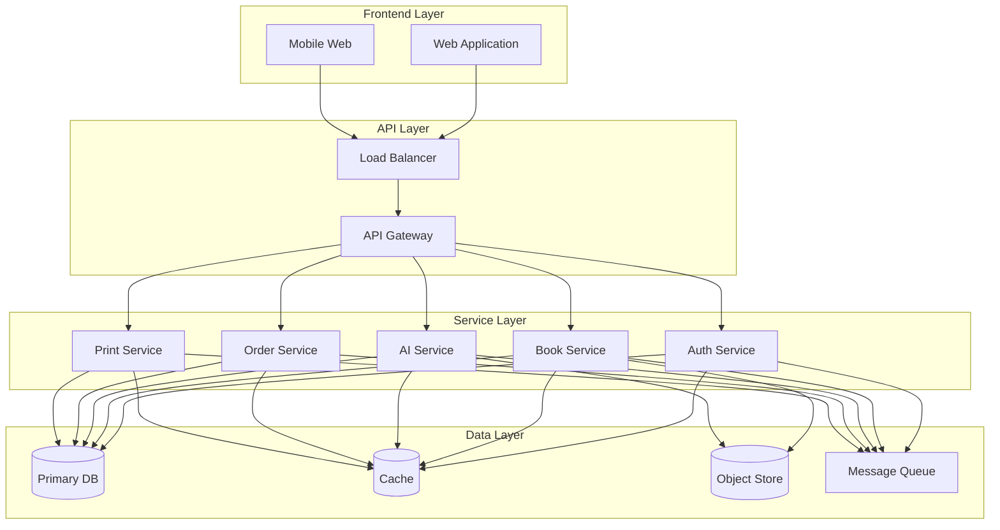
```mermaid
graph TD
    subgraph "Frontend Layer"
        A[Web Application]
        B[Mobile Web]
    end
    
    subgraph "API Layer"
        C[API Gateway]
        D[Load Balancer]
    end
    
    subgraph "Service Layer"
        E[Auth Service]
        F[Book Service]
        G[AI Service]
        H[Order Service]
        I[Print Service]
    end
    
    subgraph "Data Layer"
        J[(Primary DB)]
        K[(Cache)]
        L[(Object Store)]
        M[Message Queue]
    end
    
    A --> D
    B --> D
    D --> C
    C --> E & F & G & H & I
    E & F & G & H & I --> J
    E & F & G & H & I --> K
    F & G --> L
    E & F & G & H & I --> M
```

### 2.3.2 Communication Patterns

| Pattern | Implementation | Use Case |
|---------|---------------|----------|
| Synchronous | REST/gRPC | User interactions |
| Asynchronous | Message Queue | Content generation |
| Event-Driven | Pub/Sub | Status updates |
| Streaming | WebSocket | Real-time previews |

## 2.4 Cross-Cutting Concerns

### 2.4.1 System Monitoring

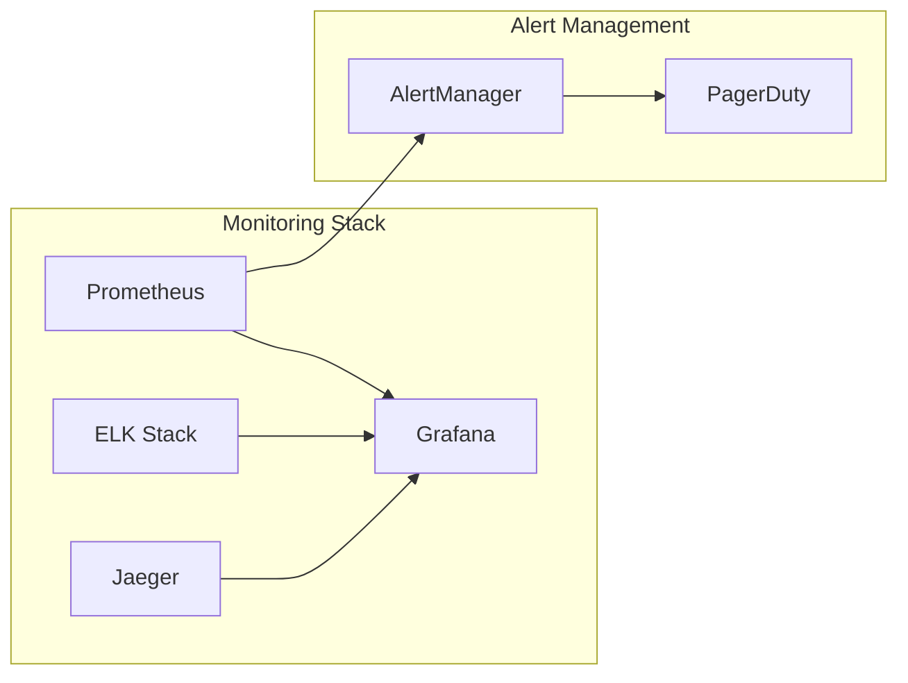
```mermaid
graph LR
    subgraph "Monitoring Stack"
        A[Prometheus]
        B[Grafana]
        C[ELK Stack]
        D[Jaeger]
    end
    
    subgraph "Alert Management"
        E[AlertManager]
        F[PagerDuty]
    end
    
    A --> B
    A --> E
    C --> B
    D --> B
    E --> F
```

### 2.4.2 Security Architecture

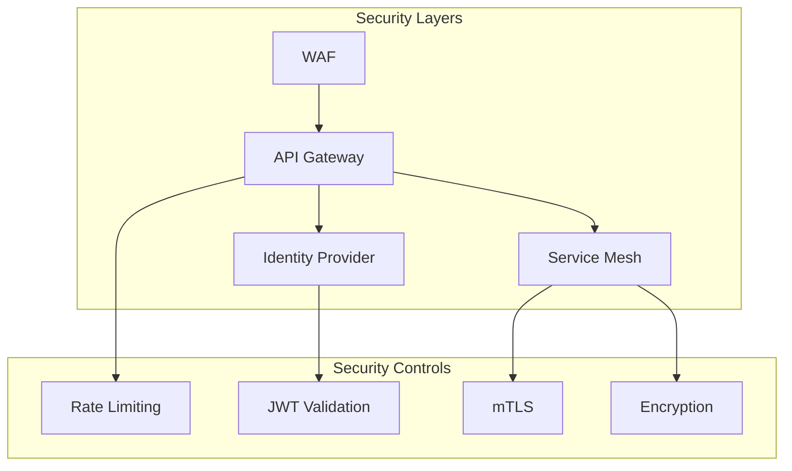
```mermaid
graph TD
    subgraph "Security Layers"
        A[WAF]
        B[API Gateway]
        C[Identity Provider]
        D[Service Mesh]
    end
    
    subgraph "Security Controls"
        E[Rate Limiting]
        F[JWT Validation]
        G[mTLS]
        H[Encryption]
    end
    
    A --> B
    B --> C
    B --> D
    C --> F
    D --> G
    D --> H
    B --> E
```

## 2.5 Deployment Architecture

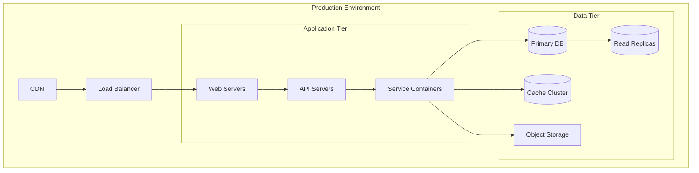
```mermaid
graph TD
    subgraph "Production Environment"
        A[CDN]
        B[Load Balancer]
        
        subgraph "Application Tier"
            C[Web Servers]
            D[API Servers]
            E[Service Containers]
        end
        
        subgraph "Data Tier"
            F[(Primary DB)]
            G[(Read Replicas)]
            H[(Cache Cluster)]
            I[Object Storage]
        end
    end
    
    A --> B
    B --> C
    C --> D
    D --> E
    E --> F & H & I
    F --> G
```

### 2.5.1 Infrastructure Requirements

| Component | Specification | Redundancy |
|-----------|--------------|------------|
| Web Servers | t3.large | Multi-AZ |
| API Servers | c5.xlarge | Multi-AZ |
| Service Containers | c5.2xlarge | Multi-AZ |
| Database | db.r5.2xlarge | Multi-AZ |
| Cache | cache.r5.xlarge | Multi-AZ |
| Load Balancer | Application LB | Cross-zone |

# 3. SYSTEM COMPONENTS ARCHITECTURE

## 3.1 USER INTERFACE DESIGN

### 3.1.1 Design Specifications

| Category | Requirements | Implementation |
|----------|--------------|----------------|
| Visual Hierarchy | Material Design 3.0 principles | Consistent spacing, typography, and color system |
| Component Library | Custom React component library | Storybook documentation with versioning |
| Responsive Design | Mobile-first approach | Breakpoints: 320px, 768px, 1024px, 1440px |
| Accessibility | WCAG 2.1 Level AA | ARIA labels, keyboard navigation, screen reader support |
| Browser Support | Modern browsers, last 2 versions | Chrome, Firefox, Safari, Edge |
| Theme Support | Light/Dark mode | CSS variables with theme switching |
| Internationalization | RTL support, content adaptation | i18next integration, flexible layouts |

### 3.1.2 Core User Flows

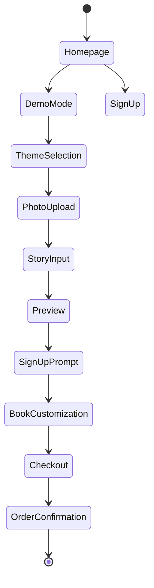
```mermaid
stateDiagram-v2
    [*] --> Homepage
    Homepage --> DemoMode
    Homepage --> SignUp
    DemoMode --> ThemeSelection
    ThemeSelection --> PhotoUpload
    PhotoUpload --> StoryInput
    StoryInput --> Preview
    Preview --> SignUpPrompt
    SignUpPrompt --> BookCustomization
    BookCustomization --> Checkout
    Checkout --> OrderConfirmation
    OrderConfirmation --> [*]
```

### 3.1.3 Component Architecture

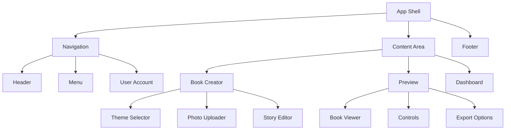
```mermaid
graph TD
    A[App Shell] --> B[Navigation]
    A --> C[Content Area]
    A --> D[Footer]
    
    B --> B1[Header]
    B --> B2[Menu]
    B --> B3[User Account]
    
    C --> C1[Book Creator]
    C --> C2[Preview]
    C --> C3[Dashboard]
    
    C1 --> C1a[Theme Selector]
    C1 --> C1b[Photo Uploader]
    C1 --> C1c[Story Editor]
    
    C2 --> C2a[Book Viewer]
    C2 --> C2b[Controls]
    C2 --> C2c[Export Options]
```

## 3.2 DATABASE DESIGN

### 3.2.1 Schema Design

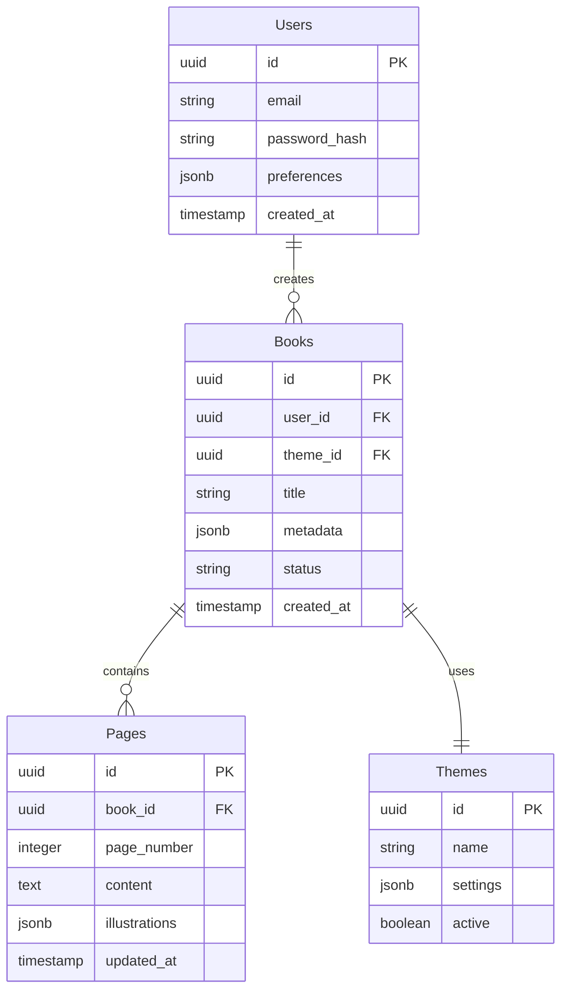
```mermaid
erDiagram
    Users ||--o{ Books : creates
    Users {
        uuid id PK
        string email
        string password_hash
        jsonb preferences
        timestamp created_at
    }
    Books ||--o{ Pages : contains
    Books ||--|| Themes : uses
    Books {
        uuid id PK
        uuid user_id FK
        uuid theme_id FK
        string title
        jsonb metadata
        string status
        timestamp created_at
    }
    Pages {
        uuid id PK
        uuid book_id FK
        integer page_number
        text content
        jsonb illustrations
        timestamp updated_at
    }
    Themes {
        uuid id PK
        string name
        jsonb settings
        boolean active
    }
```

### 3.2.2 Data Management Strategy

| Aspect | Strategy | Implementation |
|--------|----------|----------------|
| Migrations | Versioned migrations | Flyway with rollback support |
| Versioning | Semantic versioning | Database schema version tracking |
| Archival | Time-based archival | 90-day retention for inactive data |
| Audit Logging | Change data capture | Debezium for event streaming |
| Backup | Point-in-time recovery | Daily full, hourly incremental |
| Encryption | Column-level encryption | AES-256 for sensitive data |

### 3.2.3 Performance Optimization

| Strategy | Implementation | Metrics |
|----------|----------------|---------|
| Indexing | Composite indexes for common queries | Query time < 100ms |
| Partitioning | Range partitioning by date | Max partition size 100GB |
| Caching | Redis with write-through | Cache hit ratio > 80% |
| Replication | Multi-AZ read replicas | RPO < 1s, RTO < 1min |
| Connection Pooling | HikariCP | Pool size: 20-50 connections |
| Query Optimization | Materialized views for reports | Refresh interval: 1 hour |

## 3.3 API DESIGN

### 3.3.1 API Architecture

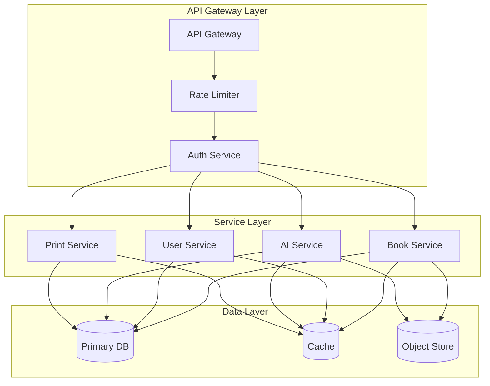
```mermaid
graph TD
    subgraph "API Gateway Layer"
        A[API Gateway]
        B[Rate Limiter]
        C[Auth Service]
    end
    
    subgraph "Service Layer"
        D[Book Service]
        E[User Service]
        F[AI Service]
        G[Print Service]
    end
    
    subgraph "Data Layer"
        H[(Primary DB)]
        I[(Cache)]
        J[(Object Store)]
    end
    
    A --> B
    B --> C
    C --> D & E & F & G
    D & E & F & G --> H
    D & E & F & G --> I
    D & F --> J
```

### 3.3.2 API Specifications

| Category | Specification | Implementation |
|----------|--------------|----------------|
| Protocol | REST/HTTP/2 | OpenAPI 3.0 documentation |
| Authentication | JWT + OAuth 2.0 | Token-based with refresh |
| Rate Limiting | Token bucket algorithm | 100 requests/min per user |
| Versioning | URI versioning | /api/v1/resource |
| Content Type | JSON/HAL | RFC 7807 problem details |
| Security | TLS 1.3 | Certificate pinning |

### 3.3.3 Core Endpoints

| Endpoint | Method | Purpose | Rate Limit |
|----------|--------|---------|------------|
| /api/v1/books | POST | Create new book | 10/min |
| /api/v1/books/{id} | GET | Retrieve book | 100/min |
| /api/v1/books/{id}/pages | POST | Add page | 30/min |
| /api/v1/generate/story | POST | Generate content | 5/min |
| /api/v1/generate/illustration | POST | Create illustration | 5/min |
| /api/v1/orders | POST | Create order | 10/min |

### 3.3.4 Integration Patterns

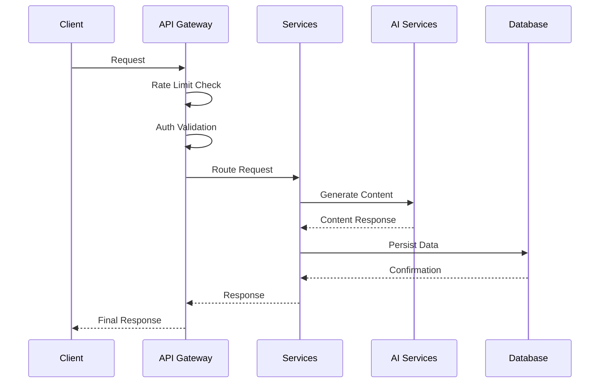
```mermaid
sequenceDiagram
    participant C as Client
    participant G as API Gateway
    participant S as Services
    participant AI as AI Services
    participant DB as Database
    
    C->>G: Request
    G->>G: Rate Limit Check
    G->>G: Auth Validation
    G->>S: Route Request
    S->>AI: Generate Content
    AI-->>S: Content Response
    S->>DB: Persist Data
    DB-->>S: Confirmation
    S-->>G: Response
    G-->>C: Final Response
```

# 4. TECHNOLOGY STACK

## 4.1 PROGRAMMING LANGUAGES

| Platform | Language | Version | Justification |
|----------|----------|---------|---------------|
| Frontend | TypeScript | 5.0+ | Type safety, enhanced IDE support, reduced runtime errors |
| Backend API | Node.js | 18 LTS | Event-driven architecture, extensive package ecosystem |
| AI Services | Python | 3.11+ | Superior AI/ML library support, OpenAI SDK compatibility |
| Build Tools | Go | 1.20+ | Fast compilation, efficient resource utilization |
| Infrastructure | HCL | 2.0+ | Native Terraform support, declarative syntax |

## 4.2 FRAMEWORKS & LIBRARIES

### 4.2.1 Frontend Stack

| Component | Technology | Version | Purpose |
|-----------|------------|---------|----------|
| Core Framework | React | 18.2+ | Component-based architecture, virtual DOM efficiency |
| State Management | Redux Toolkit | 1.9+ | Predictable state updates, RTK Query integration |
| UI Components | Material-UI | 5.14+ | Consistent design system, accessibility compliance |
| Form Handling | React Hook Form | 7.45+ | Performance-optimized form validation |
| API Client | Axios | 1.4+ | Request interceptors, response caching |

### 4.2.2 Backend Stack

| Component | Technology | Version | Purpose |
|-----------|------------|---------|----------|
| API Framework | Express | 4.18+ | Middleware support, routing flexibility |
| Validation | Joi | 17.9+ | Schema validation, type coercion |
| ORM | Prisma | 5.0+ | Type-safe database queries, migrations |
| Task Queue | Bull | 4.10+ | Redis-backed job processing |
| WebSocket | Socket.io | 4.7+ | Real-time preview updates |

## 4.3 DATABASES & STORAGE

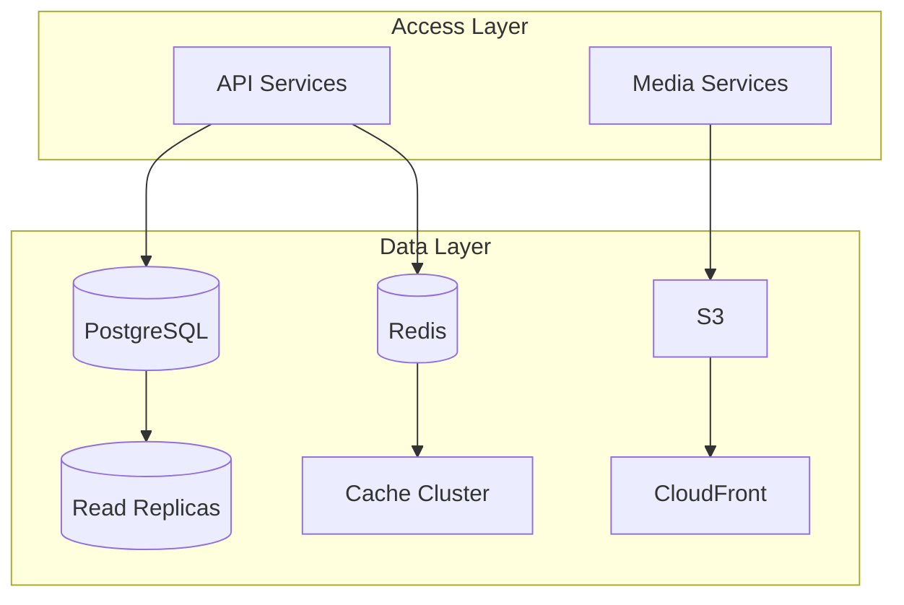
```mermaid
graph TD
    subgraph "Data Layer"
        A[(PostgreSQL)] --> B[(Read Replicas)]
        C[(Redis)] --> D[Cache Cluster]
        E[S3] --> F[CloudFront]
    end
    
    subgraph "Access Layer"
        G[API Services] --> A
        G --> C
        H[Media Services] --> E
    end
```

### 4.3.1 Data Storage Solutions

| Type | Technology | Version | Purpose |
|------|------------|---------|----------|
| Primary Database | PostgreSQL | 15+ | ACID compliance, JSON support |
| Cache Layer | Redis | 7.0+ | Session storage, job queues |
| Object Storage | AWS S3 | - | Media assets, generated content |
| Search Engine | Elasticsearch | 8.8+ | Content search, analytics |

## 4.4 THIRD-PARTY SERVICES

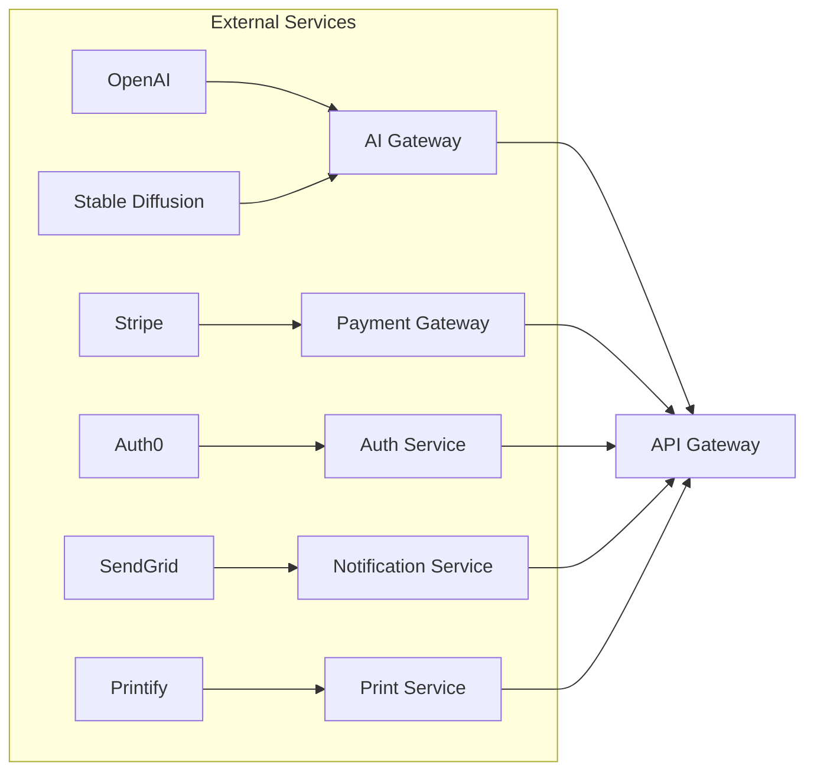
```mermaid
graph LR
    subgraph "External Services"
        A[OpenAI] --> G[AI Gateway]
        B[Stable Diffusion] --> G
        C[Stripe] --> H[Payment Gateway]
        D[Auth0] --> I[Auth Service]
        E[SendGrid] --> J[Notification Service]
        F[Printify] --> K[Print Service]
    end
    
    G & H & I & J & K --> L[API Gateway]
```

| Service | Provider | Integration Method | Purpose |
|---------|----------|-------------------|----------|
| AI Generation | OpenAI | REST API | Story generation |
| Image Generation | Stable Diffusion | REST API | Book illustrations |
| Authentication | Auth0 | SDK/OAuth2 | User management |
| Payments | Stripe | SDK/Webhooks | Transaction processing |
| Email | SendGrid | SMTP/API | Notifications |
| Monitoring | DataDog | Agent/API | System observability |

## 4.5 DEVELOPMENT & DEPLOYMENT

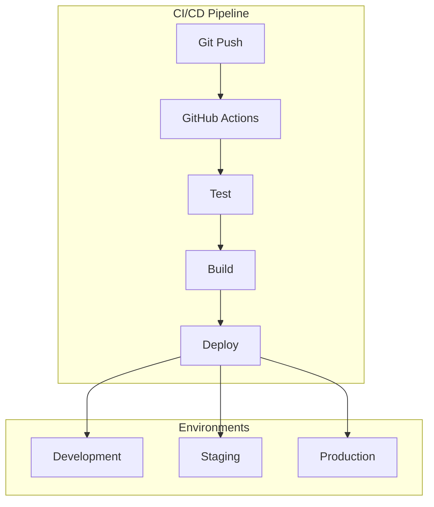
```mermaid
graph TD
    subgraph "CI/CD Pipeline"
        A[Git Push] --> B[GitHub Actions]
        B --> C[Test]
        C --> D[Build]
        D --> E[Deploy]
    end
    
    subgraph "Environments"
        E --> F[Development]
        E --> G[Staging]
        E --> H[Production]
    end
```

### 4.5.1 Development Tools

| Category | Tool | Version | Purpose |
|----------|------|---------|----------|
| IDE | VS Code | Latest | Development environment |
| Version Control | Git | 2.40+ | Source code management |
| Package Manager | pnpm | 8.6+ | Dependency management |
| API Testing | Postman | Latest | Endpoint validation |
| Linting | ESLint | 8.44+ | Code quality |

### 4.5.2 Infrastructure

| Component | Technology | Version | Purpose |
|-----------|------------|---------|----------|
| Containers | Docker | 24.0+ | Application packaging |
| Orchestration | ECS | Latest | Container management |
| IaC | Terraform | 1.5+ | Infrastructure provisioning |
| CI/CD | GitHub Actions | Latest | Deployment automation |
| Monitoring | DataDog | Latest | Performance tracking |

# 5. SYSTEM DESIGN

## 5.1 USER INTERFACE DESIGN

### 5.1.1 Layout Structure

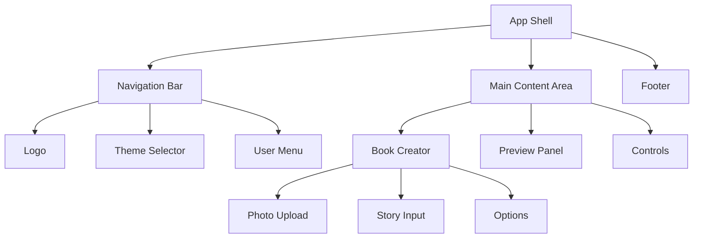
```mermaid
graph TD
    A[App Shell] --> B[Navigation Bar]
    A --> C[Main Content Area]
    A --> D[Footer]
    
    B --> B1[Logo]
    B --> B2[Theme Selector]
    B --> B3[User Menu]
    
    C --> C1[Book Creator]
    C --> C2[Preview Panel]
    C --> C3[Controls]
    
    C1 --> C1a[Photo Upload]
    C1 --> C1b[Story Input]
    C1 --> C1c[Options]
```

### 5.1.2 Core Components

| Component | Purpose | Interactions |
|-----------|----------|-------------|
| Theme Selector | Visual style selection | Grid of theme cards with hover previews |
| Photo Uploader | Image management | Drag-drop zone, crop/rotate tools |
| Story Editor | Content customization | Rich text input with AI suggestions |
| Preview Panel | Real-time visualization | Page flip animation, zoom controls |
| Progress Bar | Status indication | Step completion tracking |

### 5.1.3 Responsive Breakpoints

| Breakpoint | Layout | Components |
|------------|---------|------------|
| Desktop (>1200px) | Two-column split | Full feature set |
| Tablet (768-1199px) | Stacked panels | Collapsible sections |
| Mobile (<767px) | Single column | Simplified controls |

## 5.2 DATABASE DESIGN

### 5.2.1 Schema Design

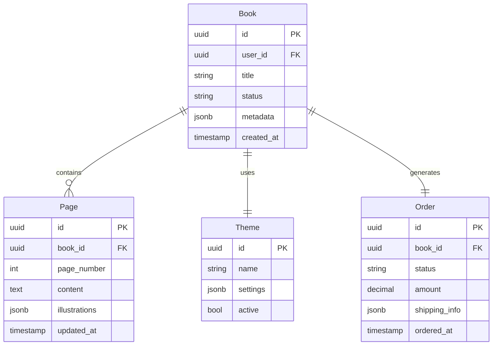
```mermaid
erDiagram
    Book ||--o{ Page : contains
    Book ||--|| Theme : uses
    Book ||--|| Order : generates
    Book {
        uuid id PK
        uuid user_id FK
        string title
        string status
        jsonb metadata
        timestamp created_at
    }
    Page {
        uuid id PK
        uuid book_id FK
        int page_number
        text content
        jsonb illustrations
        timestamp updated_at
    }
    Theme {
        uuid id PK
        string name
        jsonb settings
        bool active
    }
    Order {
        uuid id PK
        uuid book_id FK
        string status
        decimal amount
        jsonb shipping_info
        timestamp ordered_at
    }
```

### 5.2.2 Indexing Strategy

| Table | Index Type | Columns | Purpose |
|-------|------------|---------|----------|
| Book | B-tree | (user_id, created_at) | User's book lookup |
| Page | B-tree | (book_id, page_number) | Page ordering |
| Order | B-tree | (book_id, status) | Order tracking |
| Theme | Hash | (name) | Theme lookup |

### 5.2.3 Data Partitioning

| Entity | Partition Strategy | Retention |
|--------|-------------------|-----------|
| Books | Range by created_at | Indefinite |
| Pages | List by book_id | Indefinite |
| Orders | Range by ordered_at | 7 years |
| Audit Logs | Range by timestamp | 90 days |

## 5.3 API DESIGN

### 5.3.1 RESTful Endpoints

| Endpoint | Method | Purpose | Rate Limit |
|----------|---------|---------|------------|
| /api/v1/books | POST | Create new book | 10/min |
| /api/v1/books/{id}/pages | PUT | Update page content | 30/min |
| /api/v1/generate/story | POST | Generate AI content | 5/min |
| /api/v1/generate/illustration | POST | Create illustration | 5/min |

### 5.3.2 Request/Response Flow

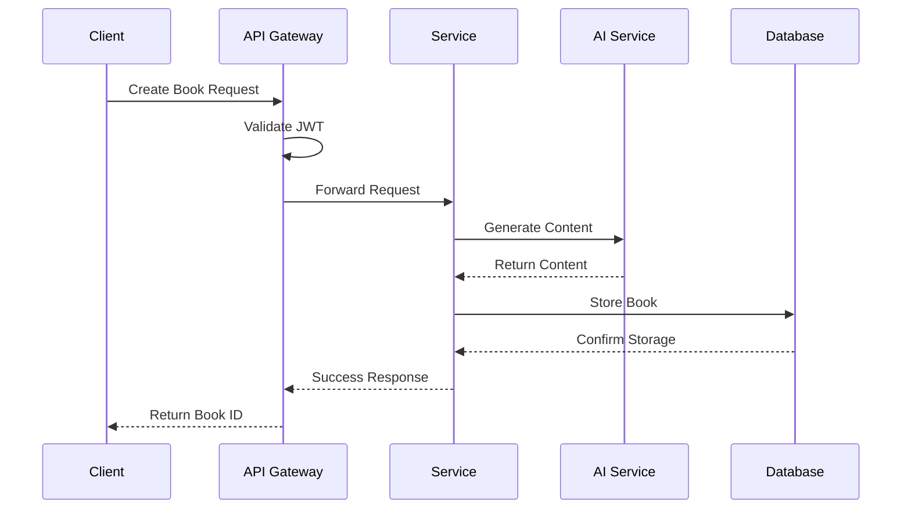
```mermaid
sequenceDiagram
    participant C as Client
    participant G as API Gateway
    participant S as Service
    participant AI as AI Service
    participant DB as Database

    C->>G: Create Book Request
    G->>G: Validate JWT
    G->>S: Forward Request
    S->>AI: Generate Content
    AI-->>S: Return Content
    S->>DB: Store Book
    DB-->>S: Confirm Storage
    S-->>G: Success Response
    G-->>C: Return Book ID
```

### 5.3.3 API Security

| Layer | Implementation | Purpose |
|-------|----------------|---------|
| Authentication | JWT + OAuth2 | Identity verification |
| Authorization | RBAC | Access control |
| Rate Limiting | Token bucket | Resource protection |
| Encryption | TLS 1.3 | Data in transit |
| Validation | JSON Schema | Input sanitization |

### 5.3.4 Error Handling

| Error Category | HTTP Status | Response Format |
|----------------|-------------|-----------------|
| Validation | 400 | {error: string, details: object} |
| Authentication | 401 | {error: string, code: string} |
| Authorization | 403 | {error: string, required: string[]} |
| Resource | 404 | {error: string, resource: string} |
| Server | 500 | {error: string, id: string} |

# 6. USER INTERFACE DESIGN

## 6.1 Design System

### 6.1.1 Component Key
```
Icons:
[?] - Help/Information tooltip
[$] - Payment/Pricing element
[i] - Information indicator
[+] - Add/Create action
[x] - Close/Delete action
[<][>] - Navigation controls
[^] - Upload function
[#] - Menu/Dashboard
[@] - User/Profile
[!] - Alert/Warning
[=] - Settings/Menu
[*] - Favorite/Important

Interactive Elements:
[ ] - Checkbox
( ) - Radio button
[Button] - Clickable button
[...] - Text input field
[====] - Progress indicator
[v] - Dropdown menu
```

## 6.2 Core Screens

### 6.2.1 Homepage
```
+--------------------------------------------------+
|  [@] Login/Register    [?] Help    [=] Settings   |
+--------------------------------------------------+
|                                                   |
|        Create Magical Stories for Children        |
|                                                   |
|    [Try Demo Now]        [See How It Works]       |
|                                                   |
|  +----------------+  +----------------+           |
|  | Sample Book 1  |  | Sample Book 2  |           |
|  | [Preview]      |  | [Preview]      |           |
|  +----------------+  +----------------+           |
|                                                   |
|  [====================================] Step 1/4  |
+--------------------------------------------------+
```

### 6.2.2 Book Creator Interface
```
+--------------------------------------------------+
| [<] Back    Book Creator    [@] Account           |
+--------------------------------------------------+
|  +-------------------+  +--------------------+     |
|  | Theme Selection   |  | Preview Panel      |     |
|  | ( ) Magical       |  |                    |     |
|  | ( ) Adventure     |  |    [Page 1/12]     |     |
|  | ( ) Educational   |  |    [< Prev][Next >]|     |
|  +-------------------+  +--------------------+     |
|                                                   |
|  [^] Upload Photos                                |
|  +-------------------+                            |
|  | Drag & Drop Here  |    [!] Supported formats:  |
|  | or [Browse Files] |    JPEG, PNG, HEIF         |
|  +-------------------+                            |
|                                                   |
|  Story Details:                                   |
|  Character Name: [..................]             |
|  Age: [v]                                        |
|  Interests: [ ] Sports [ ] Music [ ] Animals     |
|                                                   |
|  [Generate Story]    [Save Progress]             |
+--------------------------------------------------+
```

### 6.2.3 Preview Mode
```
+--------------------------------------------------+
| [x] Close    Preview Mode    [$] Upgrade to Save  |
+--------------------------------------------------+
|  +----------------------------------------+      |
|  |                                        |      |
|  |           Book Preview Area            |      |
|  |         (Watermarked Content)          |      |
|  |                                        |      |
|  |  [< Previous Page]    [Next Page >]    |      |
|  |         Page 3 of 5 (Demo)             |      |
|  +----------------------------------------+      |
|                                                  |
|  [*] Love what you see?                         |
|  [Create Account to Save Your Progress]          |
|                                                  |
|  Options:                                        |
|  [Share Preview]  [Start Over]  [Choose Theme]   |
+--------------------------------------------------+
```

### 6.2.4 Customization Panel
```
+--------------------------------------------------+
| [=] Menu    Customize Your Book    [?] Help       |
+--------------------------------------------------+
|  Style Options:                                   |
|  +-------------------+  +-------------------+     |
|  | Cover Style       |  | Paper Quality     |     |
|  | [v] Hardcover     |  | [v] Premium       |     |
|  +-------------------+  +-------------------+     |
|                                                   |
|  Color Theme:                                     |
|  ( ) Vibrant    ( ) Pastel    ( ) Classic        |
|                                                   |
|  Font Selection:                                  |
|  [v] Choose Font Style                            |
|                                                   |
|  Special Features:                                |
|  [ ] Dedication Page                              |
|  [ ] Gift Wrapping                               |
|  [ ] Digital Copy                                |
|                                                   |
|  [Preview Changes]    [Save Design]    [$] Price  |
+--------------------------------------------------+
```

## 6.3 Responsive Breakpoints

### 6.3.1 Mobile View (320px - 767px)
```
+------------------+
| [=] Menu [@]     |
+------------------+
| Book Creator     |
|                  |
| [v] Theme        |
| [^] Photos       |
| [...] Details    |
|                  |
| [Preview]        |
| [Save]           |
+------------------+
```

### 6.3.2 Tablet View (768px - 1024px)
```
+--------------------------------+
| [=] Menu     [@] Account       |
+--------------------------------+
|  +-----------+ +------------+  |
|  | Creator   | | Preview    |  |
|  | Panel     | | Panel      |  |
|  |           | |            |  |
|  +-----------+ +------------+  |
|                               |
|  [Generate]    [Save]         |
+--------------------------------+
```

## 6.4 Navigation Flow

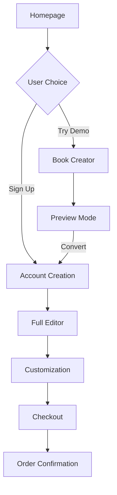
```mermaid
graph TD
    A[Homepage] --> B{User Choice}
    B -->|Try Demo| C[Book Creator]
    B -->|Sign Up| D[Account Creation]
    C --> E[Preview Mode]
    E -->|Convert| D
    D --> F[Full Editor]
    F --> G[Customization]
    G --> H[Checkout]
    H --> I[Order Confirmation]
```

## 6.5 Interaction States

### 6.5.1 Button States
```
Normal:    [Button]
Hover:     [Button]'
Active:    [Button]*
Disabled:  [Button]_
Loading:   [====]
```

### 6.5.2 Form Validation
```
Valid:     [..........]✓
Invalid:   [..........]✗
Required:  [..........]!
Typing:    [.........|]
```

### 6.5.3 Progress Indicators
```
Not Started: [    ]
In Progress: [====    ]
Complete:    [========]
Error:       [!!!!!!!]
```

# 7. SECURITY CONSIDERATIONS

## 7.1 AUTHENTICATION AND AUTHORIZATION

### 7.1.1 Authentication Methods

| Method | Implementation | Use Case |
|--------|----------------|-----------|
| Email/Password | Bcrypt hashing with salt | Primary user authentication |
| OAuth 2.0 | Google, Facebook integration | Social sign-in |
| JWT | Access & refresh tokens | API authentication |
| MFA | Time-based OTP (optional) | Enhanced security for sensitive operations |

### 7.1.2 Authorization Model

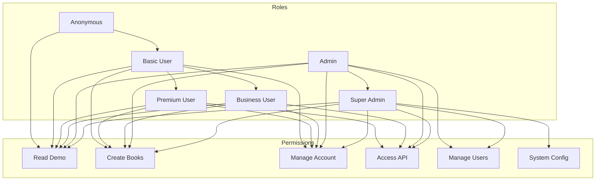
```mermaid
graph TD
    subgraph Roles
        A[Anonymous] --> B[Basic User]
        B --> C[Premium User]
        B --> D[Business User]
        E[Admin] --> F[Super Admin]
    end
    
    subgraph Permissions
        G[Read Demo]
        H[Create Books]
        I[Manage Account]
        J[Access API]
        K[Manage Users]
        L[System Config]
    end
    
    A --> G
    B --> G & H & I
    C --> G & H & I & J
    D --> G & H & I & J
    E --> G & H & I & J & K
    F --> G & H & I & J & K & L
```

### 7.1.3 Session Management

| Component | Implementation | Duration |
|-----------|----------------|-----------|
| Access Token | JWT with RS256 | 15 minutes |
| Refresh Token | Secure HTTP-only cookie | 7 days |
| Session Store | Redis cluster | 24 hours |
| Remember Me | Encrypted cookie | 30 days |

## 7.2 DATA SECURITY

### 7.2.1 Encryption Standards

| Data Type | At Rest | In Transit |
|-----------|----------|------------|
| User Credentials | AES-256 | TLS 1.3 |
| Payment Information | PCI DSS compliant | TLS 1.3 |
| Book Content | AES-256 | TLS 1.3 |
| Images | AES-256 | TLS 1.3 |
| API Keys | KMS managed | TLS 1.3 |

### 7.2.2 Data Protection Flow

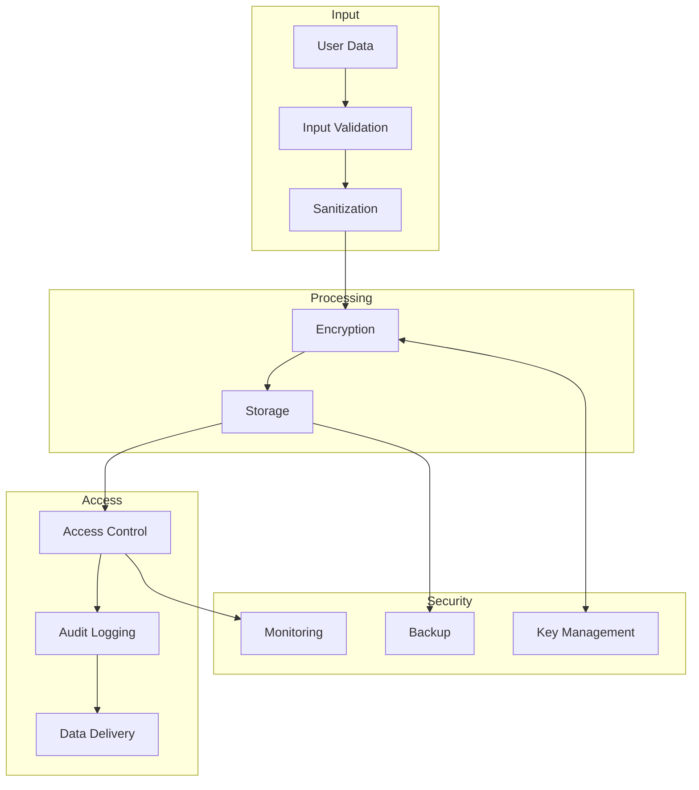
```mermaid
flowchart TD
    subgraph Input
        A[User Data] --> B[Input Validation]
        B --> C[Sanitization]
    end
    
    subgraph Processing
        C --> D[Encryption]
        D --> E[Storage]
    end
    
    subgraph Access
        E --> F[Access Control]
        F --> G[Audit Logging]
        G --> H[Data Delivery]
    end
    
    subgraph Security
        I[Key Management]
        J[Monitoring]
        K[Backup]
    end
    
    D <--> I
    E --> K
    F --> J
```

### 7.2.3 Data Classification

| Level | Type | Protection Measures |
|-------|------|-------------------|
| High | Payment Data, Credentials | Encryption, Access Logs, Limited Access |
| Medium | User Content, Images | Encryption, Regular Access |
| Low | Public Content, Themes | Basic Protection |

## 7.3 SECURITY PROTOCOLS

### 7.3.1 Network Security

```mermaid
graph TD
    subgraph External
        A[Internet] --> B[CDN]
        B --> C[WAF]
    end
    
    subgraph DMZ
        C --> D[Load Balancer]
        D --> E[API Gateway]
    end
    
    subgraph Internal
        E --> F[Application Servers]
        F --> G[Database]
        F --> H[Cache]
    end
    
    subgraph Security
        I[IDS/IPS]
        J[SIEM]
        K[Firewall]
    end
    
    C --> I
    F --> J
    E --> K
```

### 7.3.2 Security Controls

| Control Type | Implementation | Purpose |
|-------------|----------------|----------|
| WAF | AWS WAF/Cloudflare | DDoS protection, request filtering |
| Rate Limiting | Token bucket algorithm | Prevent abuse |
| Input Validation | JSON Schema, Sanitization | Prevent injection attacks |
| Monitoring | ELK Stack + Alerts | Security event detection |
| Vulnerability Scanning | Weekly automated scans | Identify weaknesses |

### 7.3.3 Security Compliance

| Standard | Requirements | Implementation |
|----------|--------------|----------------|
| GDPR | Data protection, user rights | Consent management, data portability |
| PCI DSS | Payment security | Tokenization, secure transmission |
| SOC 2 | Security controls | Audit logging, access control |
| COPPA | Child privacy | Age verification, parental consent |

### 7.3.4 Incident Response

| Phase | Actions | Responsibility |
|-------|---------|---------------|
| Detection | Automated monitoring, alerts | Security team |
| Analysis | Threat assessment, impact evaluation | Security + DevOps |
| Containment | Isolation, access restriction | DevOps team |
| Eradication | Patch deployment, system hardening | Development team |
| Recovery | Service restoration, validation | Operations team |
| Lessons Learned | Documentation, process improvement | All teams |

# 8. INFRASTRUCTURE

## 8.1 DEPLOYMENT ENVIRONMENT

```mermaid
graph TD
    subgraph Production
        A[AWS Primary Region] --- B[AWS Secondary Region]
        A --> C[CloudFront CDN]
        B --> C
    end
    
    subgraph Development
        D[Development Environment]
        E[Staging Environment]
        F[QA Environment]
    end
    
    subgraph Local
        G[Developer Machines]
        H[Local Testing]
    end
    
    G --> D
    D --> E
    E --> F
    F --> A
```

| Environment | Purpose | Infrastructure |
|-------------|---------|----------------|
| Production | Live system serving users | Multi-region AWS deployment |
| Staging | Pre-production testing | Single-region AWS deployment |
| QA | Quality assurance testing | Containerized AWS environment |
| Development | Active development | Containerized local/AWS environment |
| Local | Developer testing | Docker containers on local machines |

## 8.2 CLOUD SERVICES

| Service | Provider | Purpose | Configuration |
|---------|----------|---------|---------------|
| Compute | AWS ECS | Container hosting | Auto-scaling groups |
| Database | AWS RDS | PostgreSQL hosting | Multi-AZ deployment |
| Cache | AWS ElastiCache | Redis cluster | Multi-AZ with replicas |
| Storage | AWS S3 | Asset storage | Cross-region replication |
| CDN | CloudFront | Content delivery | Global edge locations |
| DNS | Route 53 | DNS management | Active-active routing |
| Load Balancing | ALB | Traffic distribution | Cross-zone balancing |
| Monitoring | CloudWatch | System monitoring | Custom metrics |

## 8.3 CONTAINERIZATION

```mermaid
graph TD
    subgraph Container Architecture
        A[Nginx Container] --> B[React Frontend Container]
        A --> C[API Gateway Container]
        C --> D[User Service Container]
        C --> E[Book Service Container]
        C --> F[AI Service Container]
        C --> G[Print Service Container]
    end
    
    subgraph Shared Resources
        H[(Redis Cache)]
        I[(PostgreSQL)]
        J[S3 Storage]
    end
    
    D & E & F & G --> H
    D & E & F & G --> I
    E & F --> J
```

| Component | Base Image | Resources | Scaling Strategy |
|-----------|------------|-----------|------------------|
| Frontend | node:18-alpine | 1 CPU, 2GB RAM | Horizontal |
| API Gateway | node:18-alpine | 2 CPU, 4GB RAM | Horizontal |
| User Service | node:18-alpine | 2 CPU, 4GB RAM | Horizontal |
| Book Service | python:3.11-slim | 4 CPU, 8GB RAM | Horizontal |
| AI Service | python:3.11-slim | 8 CPU, 16GB RAM | Vertical |
| Print Service | node:18-alpine | 2 CPU, 4GB RAM | Horizontal |

## 8.4 ORCHESTRATION

```mermaid
graph TD
    subgraph ECS Cluster
        A[Application Load Balancer]
        B[Service Discovery]
        
        subgraph Frontend Service
            C[Frontend Task 1]
            D[Frontend Task 2]
        end
        
        subgraph Backend Services
            E[API Tasks]
            F[Service Tasks]
            G[AI Tasks]
        end
    end
    
    A --> C & D
    C & D --> E
    E --> F & G
```

| Component | Configuration | Auto-scaling Rules |
|-----------|--------------|-------------------|
| ECS Cluster | EC2 Launch Type | CPU > 70%, Memory > 85% |
| Service Discovery | AWS Cloud Map | Health check interval: 30s |
| Task Definitions | Latest revision | Rolling updates |
| Container Insights | Enabled | Performance monitoring |
| Load Balancing | Application LB | Target tracking |

## 8.5 CI/CD PIPELINE

```mermaid
graph LR
    A[Git Push] --> B[GitHub Actions]
    B --> C[Build & Test]
    C --> D[Security Scan]
    D --> E{Branch?}
    E -->|main| F[Deploy to Staging]
    E -->|develop| G[Deploy to Dev]
    F --> H[Integration Tests]
    H --> I[Deploy to Production]
    G --> J[Development Tests]
```

| Stage | Tools | Actions | SLA |
|-------|-------|---------|-----|
| Source Control | GitHub | Code versioning, PR reviews | < 5min |
| Build | GitHub Actions | Compile, test, containerize | < 10min |
| Security | Snyk, SonarQube | Vulnerability scanning, code quality | < 15min |
| Testing | Jest, Pytest | Unit, integration tests | < 20min |
| Deployment | AWS CDK | Infrastructure as Code | < 15min |
| Monitoring | DataDog | Performance monitoring | Real-time |

### Deployment Strategy

| Environment | Strategy | Rollback Time | Monitoring Period |
|-------------|----------|---------------|-------------------|
| Development | Direct deployment | Immediate | 1 hour |
| Staging | Blue/Green | < 5 minutes | 24 hours |
| Production | Canary | < 2 minutes | 48 hours |

# APPENDICES

## A.1 ADDITIONAL TECHNICAL INFORMATION

### A.1.1 AI Model Specifications

| Model | Purpose | Parameters | Response Time |
|-------|---------|------------|---------------|
| GPT-4 | Story Generation | Max 4000 tokens | < 30s |
| Stable Diffusion XL | Illustration Creation | 512x512px base | < 45s |
| Custom Vision Model | Photo Enhancement | ResNet50 backbone | < 10s |

### A.1.2 Print Production Standards

```mermaid
graph TD
    A[Print Job] --> B{Format Check}
    B -->|Pass| C[Color Profile]
    B -->|Fail| D[Error Report]
    C --> E{Resolution Check}
    E -->|Pass| F[Printer Queue]
    E -->|Fail| G[Upscaling]
    G --> E
    F --> H[Local Printer]
```

| Specification | Requirement | Standard |
|--------------|-------------|-----------|
| Color Space | CMYK | ISO 12647-2 |
| Resolution | 300 DPI | ISO 15930-1 |
| Bleed | 3mm | ISO 19593-1 |
| Paper Stock | FSC Certified | ISO 9706 |

## A.2 GLOSSARY

| Term | Definition |
|------|------------|
| Bleed | Extra printable area beyond the final trim size |
| Color Profile | ICC-compliant color management specification |
| Demo-to-Conversion | Process of converting trial users to paid customers |
| Edge Location | CDN point of presence for content distribution |
| Local Printer Network | Distributed network of eco-friendly print partners |
| Pre-flight Check | Automated print file validation process |
| Progress-saving | Automatic preservation of user's work state |
| Theme | Predefined story template with visual and narrative elements |
| Token | Unit of text processing for AI models |
| Watermarking | Digital overlay for protecting preview content |

## A.3 ACRONYMS

| Acronym | Full Form |
|---------|------------|
| AI | Artificial Intelligence |
| API | Application Programming Interface |
| AWS | Amazon Web Services |
| CCPA | California Consumer Privacy Act |
| CDN | Content Delivery Network |
| CMYK | Cyan, Magenta, Yellow, Key (Black) |
| COPPA | Children's Online Privacy Protection Act |
| DPI | Dots Per Inch |
| FSC | Forest Stewardship Council |
| GDPR | General Data Protection Regulation |
| HEIF | High Efficiency Image Format |
| ICC | International Color Consortium |
| ISO | International Organization for Standardization |
| JWT | JSON Web Token |
| KMS | Key Management Service |
| ML | Machine Learning |
| PCI DSS | Payment Card Industry Data Security Standard |
| PDF | Portable Document Format |
| RBAC | Role-Based Access Control |
| REST | Representational State Transfer |
| RGB | Red, Green, Blue |
| S3 | Simple Storage Service |
| SLA | Service Level Agreement |
| SSL | Secure Sockets Layer |
| TLS | Transport Layer Security |
| UI | User Interface |
| UUID | Universally Unique Identifier |
| WCAG | Web Content Accessibility Guidelines |
| XML | Extensible Markup Language |

## A.4 REFERENCE STANDARDS

```mermaid
mindmap
    root((Standards))
        Security
            PCI DSS v4.0
            ISO 27001:2013
            NIST 800-53
        Print Quality
            ISO 12647-2
            ISO 15930-1
            ISO 19593-1
        Color Management
            ICC v4
            ISO 15076-1
        Accessibility
            WCAG 2.1
            Section 508
        Data Protection
            GDPR
            CCPA
            COPPA
```