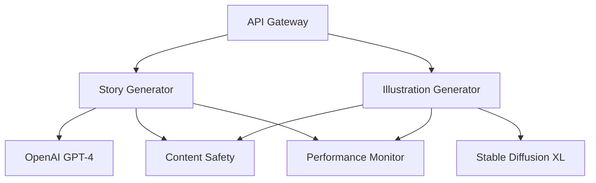

# Memorable AI Service

Enterprise-grade AI service component for generating personalized children's stories and illustrations using OpenAI GPT-4 and Stable Diffusion XL.

## Overview

The AI service is a critical component of the Memorable platform, responsible for:
- Story generation using OpenAI GPT-4 with COPPA compliance
- Illustration creation using Stable Diffusion XL with content safety
- Performance optimization meeting <30s generation requirements
- Comprehensive error handling and monitoring

## Features

### Story Generation
- Age-appropriate content generation (3-12 years)
- Theme-based storytelling with educational elements
- Content safety filtering and COPPA compliance
- Performance-optimized with <30s response time
- Automatic retry mechanism with exponential backoff

### Illustration Generation
- High-quality image generation (512x512 to 1024x1024)
- Multiple artistic styles:
  - Children's book
  - Watercolor
  - Digital art
  - Cartoon
  - Realistic
- Face enhancement processing
- Content safety checks
- Performance-optimized with <45s response time

## Technical Architecture

### Core Components


### Dependencies
- OpenAI SDK v1.3.0
- Stability SDK v0.8.0
- FastAPI v0.95.0
- Pydantic v1.10.0
- Pillow v9.5.0

## Setup and Configuration

### Prerequisites
- Python 3.11+
- Virtual environment
- API keys for OpenAI and Stable Diffusion

### Environment Variables
```bash
OPENAI_API_KEY=your_openai_key
STABLE_DIFFUSION_API_KEY=your_sd_key
ENVIRONMENT=development|staging|production
```

### Installation
```bash
# Create virtual environment
python -m venv venv
source venv/bin/activate  # Linux/Mac
.\venv\Scripts\activate   # Windows

# Install dependencies
pip install -r requirements.txt
```

## API Documentation

### Story Generation
```python
POST /api/v1/stories/generate
{
    "character_name": str,  # 1-50 chars
    "age": int,            # 3-12 years
    "theme": str,          # from supported themes
    "interests": List[str], # max 5 interests
    "additional_notes": str # optional, max 500 chars
}
```

### Illustration Generation
```python
POST /api/v1/illustrations/generate
{
    "prompt": str,         # 10-1000 chars
    "style": str,          # from supported styles
    "size": [int, int],    # width, height (512-1024)
    "enhance_faces": bool  # optional, default true
}
```

## Performance Optimization

### Story Generation
- Token optimization for GPT-4
- Response streaming
- Caching for similar prompts
- Maximum 30-second timeout

### Illustration Generation
- Optimized prompt formatting
- Resolution constraints (512x512 base)
- Image enhancement pipeline
- Maximum 45-second timeout

## Monitoring and Logging

### Metrics
- Request latency
- Token usage
- Error rates
- Generation time
- Cache hit ratio

### Logging Format
```json
{
    "timestamp": "ISO8601",
    "request_id": "UUID",
    "level": "INFO|WARNING|ERROR",
    "service": "story|illustration",
    "message": "Event description",
    "metadata": {
        "generation_time": float,
        "tokens_used": int,
        "error_type": str
    }
}
```

## Error Handling

### Common Error Types
- Rate limiting (429)
- Invalid requests (400)
- Content safety violations (422)
- Timeout errors (504)
- Service errors (500)

### Retry Strategy
- Maximum 3 retries
- Exponential backoff
- Configurable timeout
- Error telemetry

## Security

### Content Safety
- COPPA compliance checks
- Content filtering
- Input sanitization
- Output validation

### API Security
- Rate limiting
- Request validation
- Token authentication
- Error masking

## Development Guidelines

### Code Style
- Type hints required
- Docstring documentation
- Error handling required
- Performance logging
- Unit test coverage

### Testing
```bash
# Run unit tests
pytest tests/

# Run integration tests
pytest tests/integration/

# Run performance tests
pytest tests/performance/
```

## Deployment

### Container Configuration
```dockerfile
FROM python:3.11-slim
WORKDIR /app
COPY requirements.txt .
RUN pip install --no-cache-dir -r requirements.txt
COPY . .
CMD ["uvicorn", "src.app:app", "--host", "0.0.0.0", "--port", "8000"]
```

### Resource Requirements
- CPU: 2-4 cores
- RAM: 8-16GB
- Storage: 20GB
- Network: 1Gbps

## Support and Maintenance

### Troubleshooting
1. Check service health endpoints
2. Verify API key validity
3. Monitor error logs
4. Check resource utilization

### Updates
- Regular dependency updates
- Model version upgrades
- Performance optimization
- Security patches

## License
Proprietary - All rights reserved

## Contact
For technical support: [support@memorable.com](mailto:support@memorable.com)